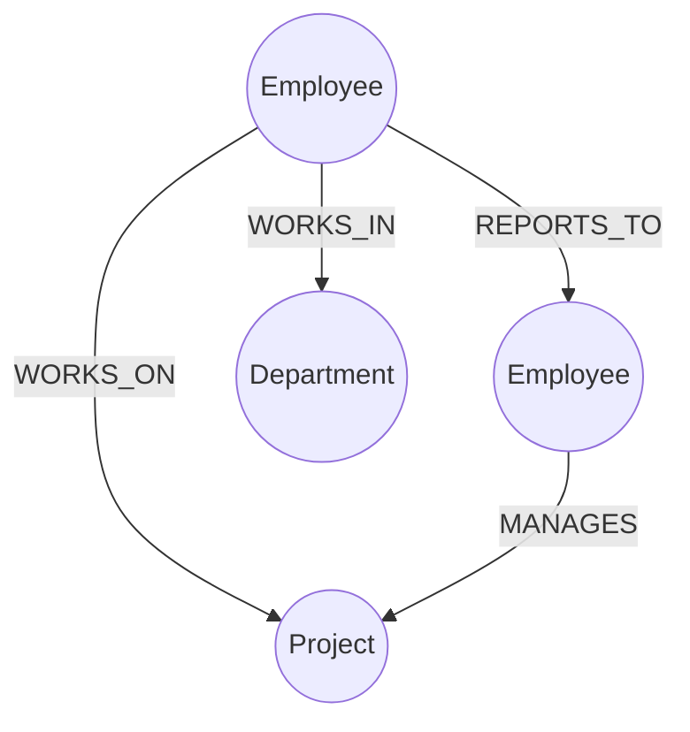

# Company Graph Application

This is a full-stack application that visualizes organizational hierarchy and relationships using a **Graph Database**. It allows a non-technical user to easily explore complex, multi-hop employee connections that would typically be awkward and slow to query in a traditional relational database.

## 🚀 Tech Stack
- **Database:** CognoDB (Neo4j)
- **Backend:** Django & Django REST Framework (Python)
- **Frontend:** React, Vite, CSS (Glassmorphism design)
- **Visualization:** Vis.js (Force-directed network graphs)

---

## 📊 Graph Data Model

The data model uses labeled nodes, typed relationships, and properties to map out the company structure. 

### Nodes
- `Employee`: Contains `id`, `name`, and `role`.
- `Department`: Contains `name`.
- `Project`: Contains `name`.

### Relationships
- `REPORTS_TO`: Connects an Employee to their Manager (Employee).
- `WORKS_IN`: Connects an Employee to a Department.
- `WORKS_ON`: Connects an Individual Contributor to a Project.
- `MANAGES`: Connects a Manager to a Project.

### Schema Diagram



---

## 🛠️ Cypher Queries

### The "Awkward SQL" Query (Multi-hop Traversal)
The backend uses a parameterised Cypher query to find an employee and traverse their 2-hop neighborhood. In a traditional SQL database, traversing a recursive reporting hierarchy (manager -> employee -> direct reports) and pulling their respective departments requires complex, nested `JOIN`s or recursive CTEs. 

In Cypher, this 2-hop hierarchy traversal is extremely simple and fast:

```cypher
MATCH (start:Employee)
WHERE toLower(start.name) CONTAINS toLower($name)
WITH start LIMIT 5

// 1. Traverse up to 2 levels of management (up or down)
OPTIONAL MATCH p1 = (start)-[:REPORTS_TO*1..2]-(colleague)
WITH start, collect(p1) as paths1

// 2. Direct projects and departments (1 hop)
OPTIONAL MATCH p2 = (start)-[:WORKS_IN|WORKS_ON|MANAGES]-(entity)
WITH start, paths1, collect(p2) as paths2

RETURN start, paths1 + paths2 as paths
```
*(Note: We strictly use parameterised queries (`$name`) via the official Neo4j Python driver to prevent injection attacks and ensure optimal query caching.)*

---

## 💻 Setup & Installation

### 1. Environment Variables
Create a `.env` file in the root directory (never commit this file) with your CognoDB credentials:
```env
NEO4J_URI=bolt+s://<your-db-url>
NEO4J_USER=neo4j
NEO4J_PASSWORD=<your-password>
```

### 2. Load Seed Data
A realistic dataset of 225 employees is generated algorithmically to properly test the graph's capabilities.
```bash
python load_data.py
```

### 3. Run Backend (Django)
```bash
cd backend
python manage.py runserver
```
*API will run at http://localhost:8000/api/graph/?employee=name*

### 4. Run Frontend (React)
```bash
cd frontend
npm install
npm run dev
```
*UI will run at http://localhost:5173*

---

## 🎨 UI/UX Design

The frontend was designed with a modern, intentional **Dashboard Interface**:
- **Clean Layout:** Split-screen design so the user can read clear text data on the left while exploring the visual force-directed graph on the right.
- **Micro-interactions:** Smooth CSS transitions on search bars, hover effects, and loading states.
- **States:** Complete empty states (before searching) and error states (if a user is not found).
- **Typography:** Uses modern `Inter` font for readability.
